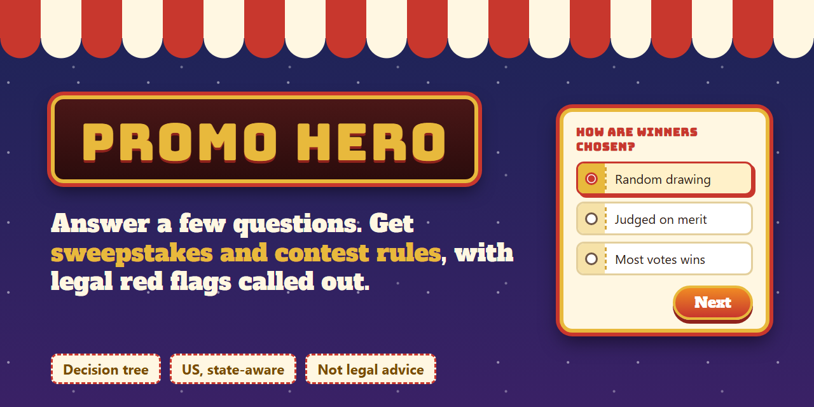

# Promo Hero



**Answer a few questions, get draft sweepstakes and contest rules, with the legal red flags called out.**

Promo Hero is a decision-tree tool for companies setting up promotions. It asks one question at a time, branches on each answer to work out the legal structure, flags anything that looks unlawful, and drafts matching Official Rules you can export to Word.

> **Not legal advice.** Promo Hero is an issue-spotting and drafting aid. Promotion law is state-specific and changes often, and the rules and thresholds in this tool have not been verified by a lawyer. Have a licensed attorney review anything before you launch a promotion.

## What it does

- **Decision tree interview.** One question at a time. Each answer decides which questions come next, and a "Your path" panel lets you jump back and change an answer.
- **Legal structure.** It sorts the promotion into a no-purchase sweepstakes, a sweepstakes with a free alternate method of entry (AMOE), a skill contest, a vote contest, or a first-come giveaway, and shows the three lottery elements: prize, chance, and payment or effort.
- **Legal flags, live.** Each flag is ranked *stop* (likely illegal as designed), *action* (a legal requirement to satisfy), or *note* (good practice). Every flag says to consult a lawyer and that this is not legal advice.
- **Drafted terms.** A clause library assembles Official Rules from your answers. Anything you have not supplied becomes a highlighted `[PLACEHOLDER]`.
- **Export.** Download a Word `.doc` (with a "read first, delete before publishing" cover page), copy the text, or print to PDF.
- **Carnival mode.** A game-booth theme by default, with a toggle to a plain theme.

### Examples of what it flags

| Level | Examples |
| --- | --- |
| Stop | Random drawing that requires a purchase with no free entry route, paid vote contests, entrants under 13, winners paying to claim a prize, cannabis, alcohol with an under-21 age limit, too little time to register in NY or FL |
| Action | NY and FL registration and bonding above $5,000 in prizes, RI registration above $500 for purchase-linked drawings, Facebook and Instagram entry rules, TCPA for text messages, missing privacy policy, missing judging criteria, charity tie-ins |
| Note | FTC disclosure for entry posts and influencers, prize taxes, travel prizes, arbitration clauses |

## Scope of v1

- Sweepstakes, skill contests, vote contests, and giveaways
- United States only, state-aware (registration triggers and state exclusions)
- Deterministic rules engine and clause library, with no AI drafting and no network calls

Not yet covered: instant win games, loyalty, referral and rebate programs, charity co-venturer terms, Canada, and per-state void-where-prohibited lists.

## Run it

No build step. Serve the folder with any static server:

```bash
npx --yes serve -l 5190 .
```

Then open http://localhost:5190. Your answers are saved in the browser.

## Test

```bash
npm test
```

The engine tests cover the lottery logic, registration triggers, interview branching, and the clause output.

## Project layout

| Path | Purpose |
| --- | --- |
| `js/questions.js` | Question schema, branching (`showIf`), and the interview order |
| `js/flags.js` | Structure classification and legal flag rules |
| `js/clauses.js` | Clause library and Official Rules assembler |
| `js/app.js` | Decision tree UI, live flags, exports, theme toggle |
| `css/style.css` | Carnival theme and plain theme |
| `test/engine.test.js` | Engine tests |
| `assets/` | Social preview image and its source |

## Contributing changes to the rules

Legal logic lives in `js/flags.js` and the clause text in `js/clauses.js`. Registration thresholds and deadlines are written from general knowledge and worded as "generally". If you are a lawyer or compliance professional, corrections are especially welcome.

## License

No license has been chosen yet. All rights reserved until one is added.
